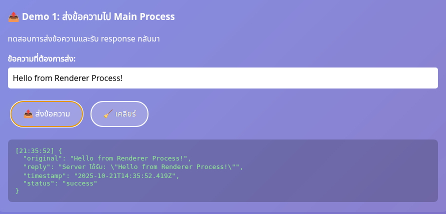
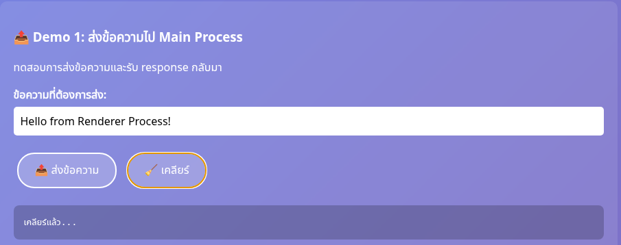
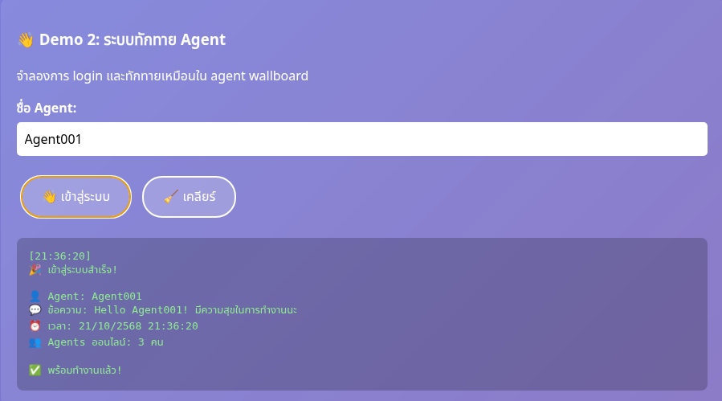
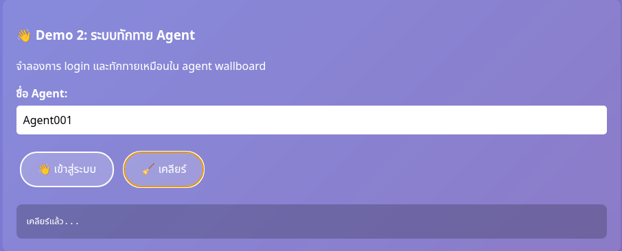
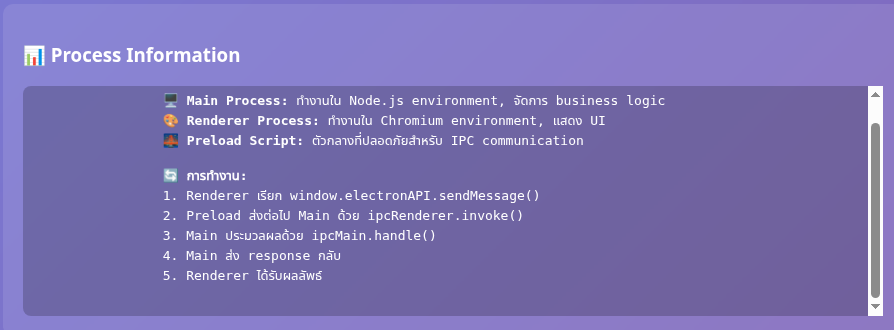
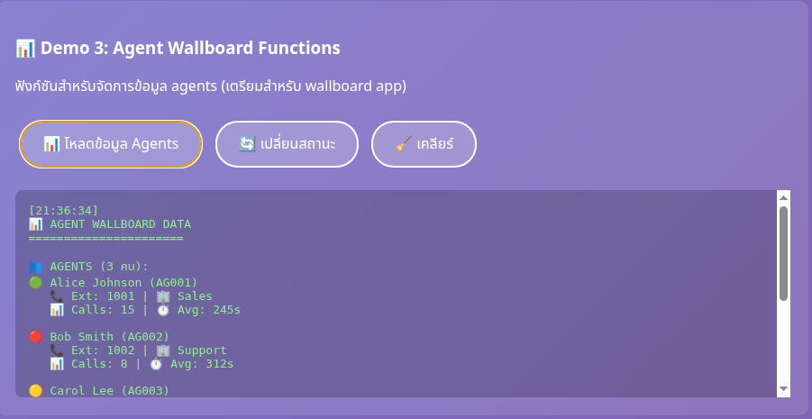
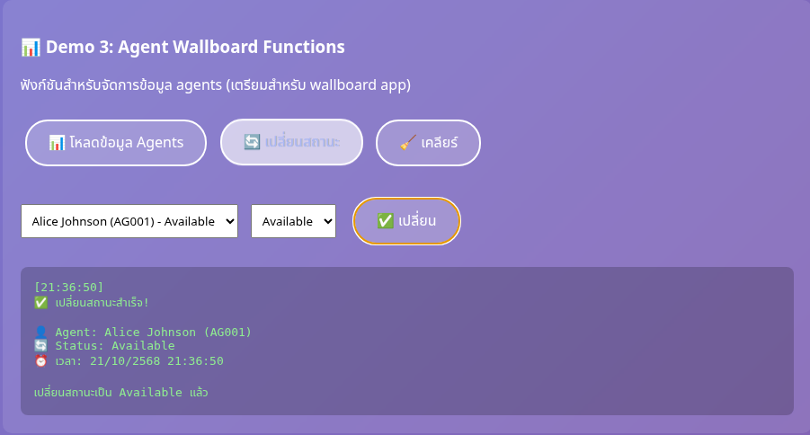
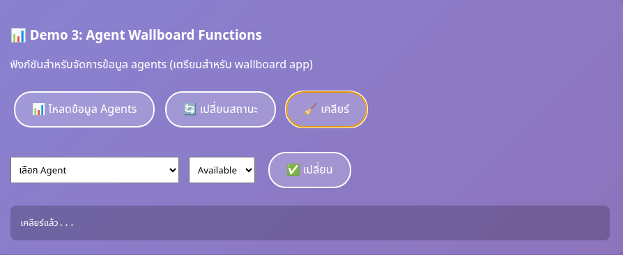

# 🔄 Lab 8.2: IPC Communication (Electron)

> **สรุปสั้น ๆ**  
> โปรเจ็กต์นี้สาธิตการสื่อสาร **IPC** ระหว่าง **Main Process** (Node.js) และ **Renderer Process** (Chromium) ผ่าน **preload.js** ที่เปิดใช้ `contextIsolation` และปิด `nodeIntegration` เพื่อความปลอดภัย พร้อมตัวอย่างฟังก์ชันจริงสำหรับ **Agent Wallboard** เช่น โหลดข้อมูลเอเจนต์ และเปลี่ยนสถานะ

## ✅ Highlights
- ใช้ `ipcMain.handle()` ↔ `ipcRenderer.invoke()` ผ่าน **preload bridge**
- รองรับ **ภาษาไทย + อีโมจิ** ครบ
- มีเดโม 4 ส่วน พร้อมรูปผลลัพธ์และปุ่ม **เคลียร์**
- โครงสร้างไฟล์เรียบง่าย: `main.js`, `preload.js`, `index.html`, `agent-data.json`

---

## ▶️ เดโมวิดีโอ (รันจริง)
> ใส่วิดีโอเดโมไว้ที่ `docs/media/lab8-2-demo.mp4` แล้ว README จะแสดงตัวเล่นอัตโนมัติ

<video src="docs/media/lab8-2-demo.mp4" controls width="840"></video>

---

## 🧪 เดโมการทำงาน + สกรีนช็อต

### 1) 📤 Demo 1: ส่งข้อความไป Main Process
- ปุ่ม **📤 ส่งข้อความ** ส่งไป Main และรับ JSON กลับ
- ปุ่ม **🧹 เคลียร์** เคลียร์กล่องผลลัพธ์

**ส่งข้อความ:**  


**เคลียร์:**  


---

### 2) 👋 Demo 2: ระบบทักทาย Agent
- ปุ่ม **👋 เข้าสู่ระบบ** ส่งชื่อไปให้ Main เลือกข้อความทักทายแบบสุ่ม
- ปุ่ม **🧹 เคลียร์** ล้างผลลัพธ์

**เข้าสู่ระบบ (ทักทาย):**  


**เคลียร์:**  


---

### 3) 📊 Process Information
อธิบายบทบาทของ **Main / Renderer / Preload** และลำดับงาน IPC



---

### 4) 📊 Demo 3: Agent Wallboard Functions
- **📊 โหลดข้อมูล Agents** อ่าน `agent-data.json` (ผ่าน Main)
- **🔄 เปลี่ยนสถานะ** แก้สถานะและเขียนกลับไฟล์
- **🧹 เคลียร์** ล้างผลลัพธ์/ซ่อนตัวเลือก

**โหลดข้อมูล Agents:**  


**เปลี่ยนสถานะ:**  


**เคลียร์:**  


---

## 🧱 โครงสร้างโปรเจ็กต์
```
.
├── main.js
├── preload.js
├── index.html
├── agent-data.json
└── docs/
    ├── images/            # สกรีนช็อต (ไฟล์ใน README นี้)
    └── media/
        └── lab8-2-demo.mp4 (วิดีโอเดโม)
```

## 🚀 วิธีรัน
```bash
npm install
npm start
```

> เปิด DevTools เพื่อดู Log ทั้งฝั่ง Renderer และ Terminal เพื่อดู Log ฝั่ง Main

---

## 🔑 แนวคิดสำคัญ (Key Concepts)
1. **Security First** – `contextIsolation: true`, `nodeIntegration: false`, ใช้ `preload.js`
2. **Async IPC** – `ipcMain.handle()` ↔ `ipcRenderer.invoke()`
3. **Data Contract** – ตอบกลับเป็น JSON ที่ระบุ `success | data | error | timestamp`
4. **UX ที่ดี** – แสดงสถานะ Loading / Success / Error + ปุ่ม **เคลียร์**
5. **Pattern การนำไปใช้จริง** – Wallboard: โหลดข้อมูล, อัปเดตสถานะ, แจ้งเตือน

---

## 📝 License
MIT
